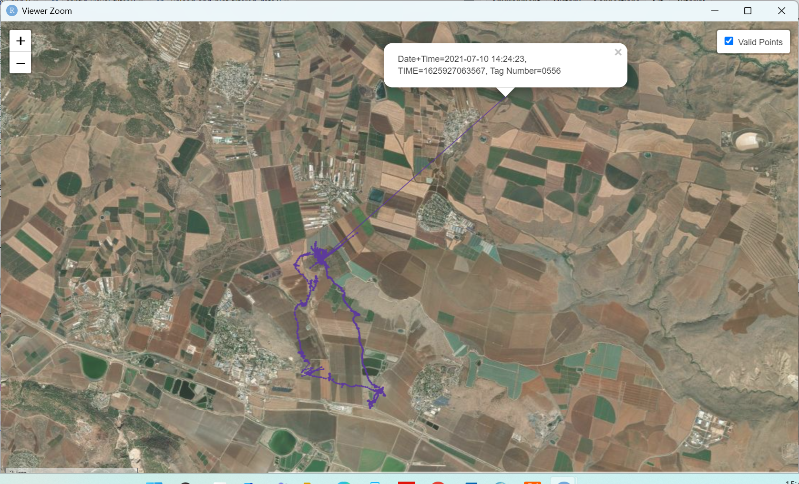

# Functions to create maps of the ATLAS data or other tracking data

## Introduction
This repository contains tools and functions for processing and visualizing ATLAS animal tracking data. It includes:

1. Functions for creating interactive maps of single and multiple ATLAS datasets.
2. A submodule for additional map features and customization (t_map).

Screenshots of sample maps created with these functions are included to showcase functionality.

## Overview of Functions
1. **interactive_map_single_atlas_dataset.R**
**Code by: Neta Tsur**
Creates an interactive map for a single dataset, including:

* Location points visualized as circles.
* Popups with detailed information for each point.
* Trajectories between points.

Example:

2. **interactive_map_two_atlas_datasets.R**
**Code by: Neta Tsur**
Creates an interactive map for two datasets, including:

* Location points for both datasets visualized in distinct colors.
* Popups with detailed information for each dataset.
* Separate trajectories for each dataset.

Example:

3. **Submodule: t_map**
**Code by: Hunter Warick**
Provides enhanced mapping capabilities, including:

* Custom legends.
* Additional styling options.

A detailed README file and additional features are inside the t_map folder.

Examples:

## Getting Started
1. Prerequisites

* R environment with the following libraries: leaflet, dplyr, sp, RColorBrewer.

2. Usage

* Clone the repository:
git clone <repository-url>
* Load required functions into your R environment using source().

