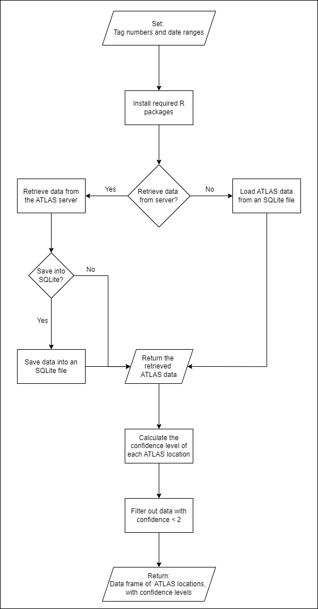

# Animal Tracker: ATLAS data analysis
*	ATLAS: Advanced Tracking and Localization of Animals in real-life Systems.
*	The ATLAS system was developed by prof. Sivan Toledo from Tel Aviv University.
*	This GitHub repository contains a collection of R scripts and functions designed to help researchers to analyse animal movement data from the ATLAS system.

## Purpose of this project
After identifying the need of users for a code that retrieves data from the ATLAS system and filters outliers, I decided to create unified functions and scripts to streamline the process. This way, we can all focus more on the fun part - understanding animals’ behaviour!

## Repository structure
The Functions repo has three main folders:
1. **Root directory:** functions that process and filter the ATLAS data 
2. **ATLAS_run_scripts:** scripts that process and filter the ATLAS data
3. **Legacy_functions:** older functions that are not being currently maintained

There is a script which does everything you might need for using the ATLAS data to analyze the animals’ movement.  
The script is found in: _ATLAS_run_scripts\\ATLAS_data_analysis_main.R_
Below you will find detailed instructions on how to run it.
The script uses many of the functions in the root directory. To understand what they do, there is a detailed documentation inside of each function file.

## Getting started
1. Make sure you have R, RStudio (if you prefer), and RTools installed on your computer
2. Make sure you have a VPN connection to the TAU server
3. Clone this repo to your PC
4. Make sure you have the configuration file _config.R_. This file includes some necessary full paths, data retrieval settings, the ATLAS database credentials, and time format of the ATLAS data.
5. Save the configuration file in your root directory of the repository: path\\to\\repository\\Functions\\config.R

## Using the script of the ATLAS data analysis pipeline

### Overview

The purpose of the _ATLAS_data_analysis_main.R_ script is to automate everything you might need to for using the ATLAS data to analyze animals’ movement.  

This includes:
1.	Retrieving multiple data batches from the ATLAS database
2.	Saving the ATLAS data into SQLite files
3.	Loading ATLAS data from the saved SQLite files, for a faster run
4.	Applying the ‘confidence filter’ to remove outliers from the location data

**R packages used in the script**  

The following packages are required, and will be automatically installed when using the script- **no need to install them- the installation is included in the script**

<u>Documentations and comments</u>
* roxygen2
*	crayon

<u>Data retrieval from the ATLAS database</u>
*	DBI
*	RMySQL
*	RSQLite

<u>Applying the confidence filter</u>
*	Rcpp
*	dplyr

<u>Plotting ATLAS data on an interactive map</u>
*	leaflet
*	sf
*	RColorBrewer
*	htmltools

### Algorithm of the script

### Running instructions of the script: step-by-step

1. If you are working remote or with a laptop which does not belong to TAU, connect to the VPN server of TAU.

2. In the _config.R_ file, set the following variables:
   
   2.1. Paths
        
        2.1.1. ‘path_to_atlas_data_analysis_repo’: full path to were this repo is saved on your PC
        
        2.1.2. ‘path_to_sqlite_files’: full path in which you want to save the SQLite files.
   
   2.2. Data Retrieval Settings
        
        2.2.1. ‘retrieve_data_from_server’:
               * TRUE: if you want to retrieve new ATLAS data from the ATLAS database in the server
               * FALSE: if you want to load the ATLAS data from a previously-saved SQLite file
        
        2.2.2. ‘save_data_to_sqlite_file’: 
               (will be used if ‘retrieve_data_from_server’ == TRUE)
               * TRUE: if you want to save the retrieved ATLAS data into an SQLite file
               * FALSE: if you do not want to save the retrieved ATLAS data

3. Set the desired tag numbers and date ranges:
   
   3.1. Open the file _ATLAS_run_scripts\\ATLAS_data_requests.R_
   
   3.2. Update the desired tag numbers and date ranges for which you want to get the ATLAS data:
        
        3.2.1. You can retrieve data of multiple tags and from multiple dates, by adding as many items as you like to the ‘data_requests’ list.
        
        3.2.2. For each list item set the tag numbers and the date range in UTC. 
        Examples:
        * A single tag number: tag = 972006000426
        * Multiple tag numbers: tag = c(972006000837, 972006000841)
        * start_time = '2022-04-10 00:00:01'
        * end_time = '2022-04-10 23:59:00'
   
   3.3. For convenience, you can create different files for different data retrievals, to better organize which data batches to load or retrieve. If you give these files different names, make sure to update the file name in _config.R_.

4. Run the script: _ATLAS_run_scripts\\ATLAS_data_analysis_main.R_

5. At the end of the run you will get the following outputs:

   5.1. 'raw_location_data': a data frame with the raw ATLAS locations.
   
   5.2. 'raw_data_with_confidence_levels': the same data frame as 'raw_location_data', but with an additional column of the confidence level.
   
   5.3. 'data__with_confidence_2': a data frame, which contains only location points with a confidence level of 2.

## Contribute
Got ideas or found bugs? Feel free to reach out!

Dr. Neta Tsur
